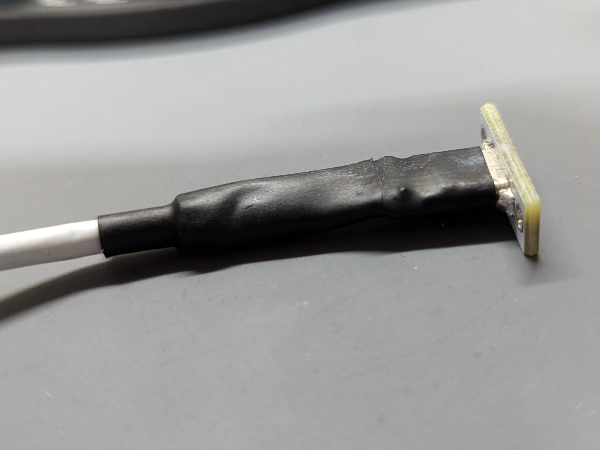

# TReK LC
GL516 inspire keyboard tray.

## 概要
このキーボードトレイは、サリチル酸さんの提唱しているキーボードケース規格「GL516」※1を基に、私が設計／頒布しているキーボードのうち、いくつかの条件に合ったキーボードでの使用を想定しています。
この条件というのは、おおまかにか下記になります。

- MCUを左右どちらかに配置している（中央配置のキーボードは使用不可です）
- スイッチプレート天面からMCU底面までの厚さが16mm
- MCU部分以外の、スイッチプレート底面から、PCB裏の最大突起物を含めた厚さが7mm以下

使用出来る対象キーボードは、

- TReK GT40Plus PARALLAX
- TReK G70 CLAVIS

になります。
下記のキーボードは使用不可になります。
- TReK GT40 DONUMCOELI（MCUが中央に配置されているため）
- TReK G50 TIJUANA（そもそもGL516ケースを使用する想定になっていないため）

## パネルマウントケーブル
このトレイは、PCB底面より下の、MCU部分の厚さ（高さ）を7mm以下にしているため、Amazonなどで売っているパネルマウントのUSB-C延長ケーブルが使用出来ません。
なので、使用するにはパネルマウント部の高さが7mm以下のパネルマウントケーブルを自作する必要があります。

私が作成したケーブルのレシピを書いておきます。

パネルマウントするUSB-C Femaleコネクタはこれを使用しました。
- https://amzn.asia/d/55BpzSk

USB-C FemaleコネクタにUSB2.0用のケーブルがハンダ付けされているので、このケーブルをそのまま使用します。
反対側のUSB-C Maleコネクタにはこれを使用しました。
- https://amzn.asia/d/052WZSY

私は後々、このケーブルを複数作ると予想したので10個入りを買いましたが、VCC, D+, D-, GNDの4端子があるUSB-C Maleコネクタであれば使えると思います。
USB-C Femaleコネクタにハンダ付けされているケーブルを、USB-C Maleコネクタにハンダ付けするのですが、その前にMale、Female両コネクタを保護するために熱収縮チューブを通しておきます。
Maleコネクタをハンダ付けする前に、すでにハンダ付けされているFemaleコネクタに熱収縮チューブを通し熱して保護しておくと良いでしょう。

