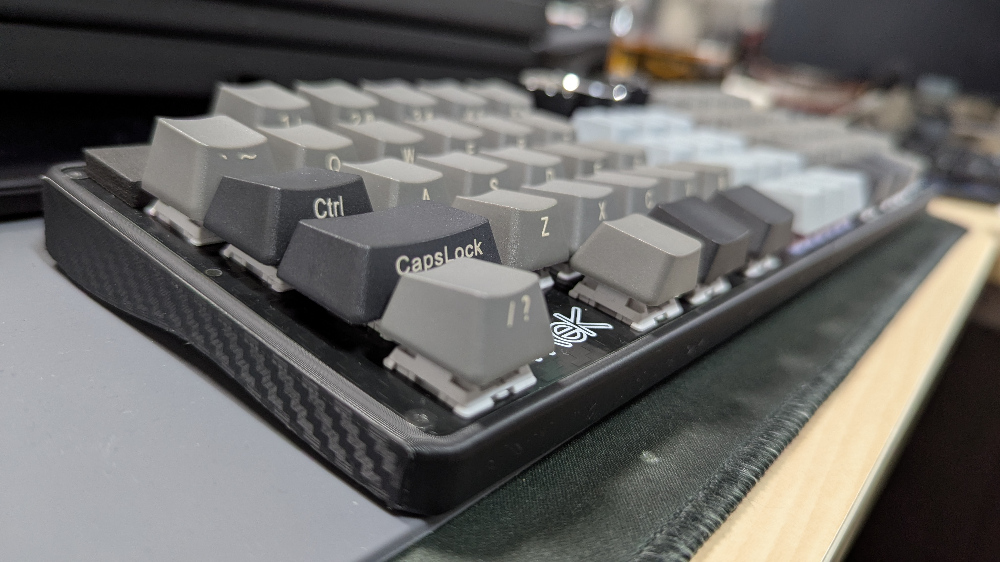
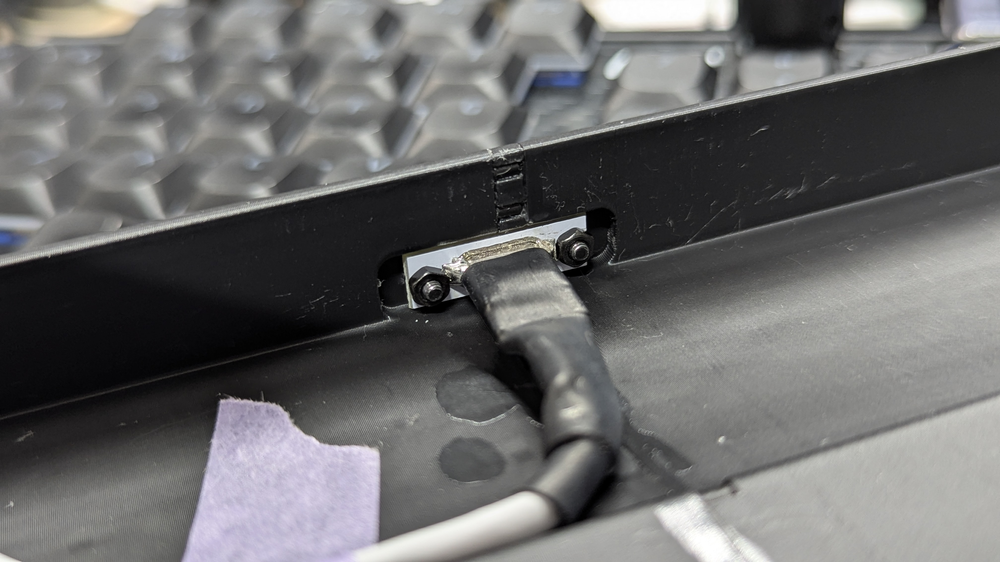
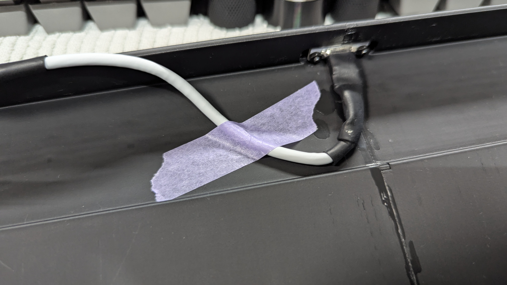
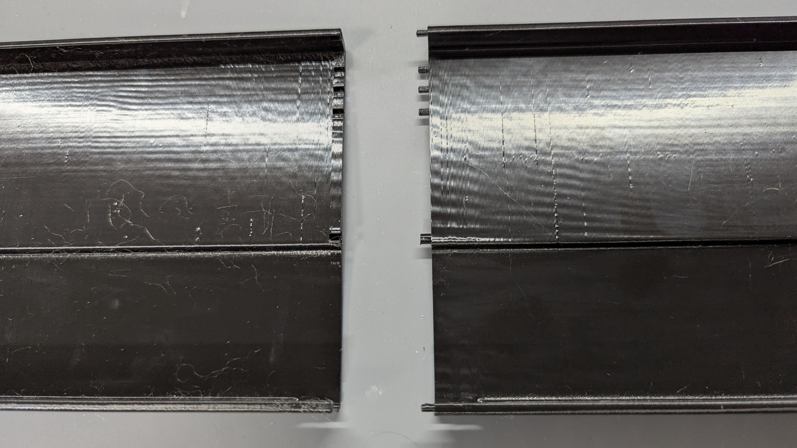
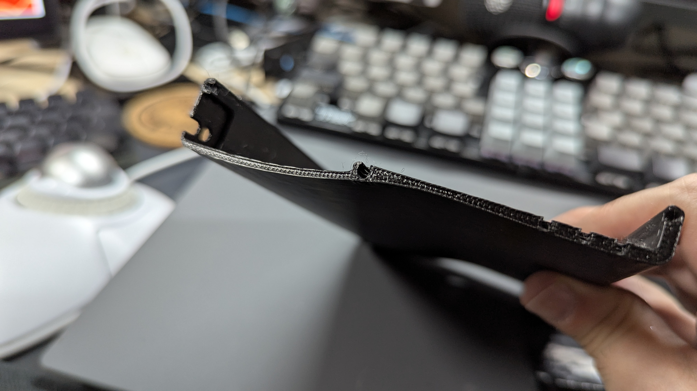
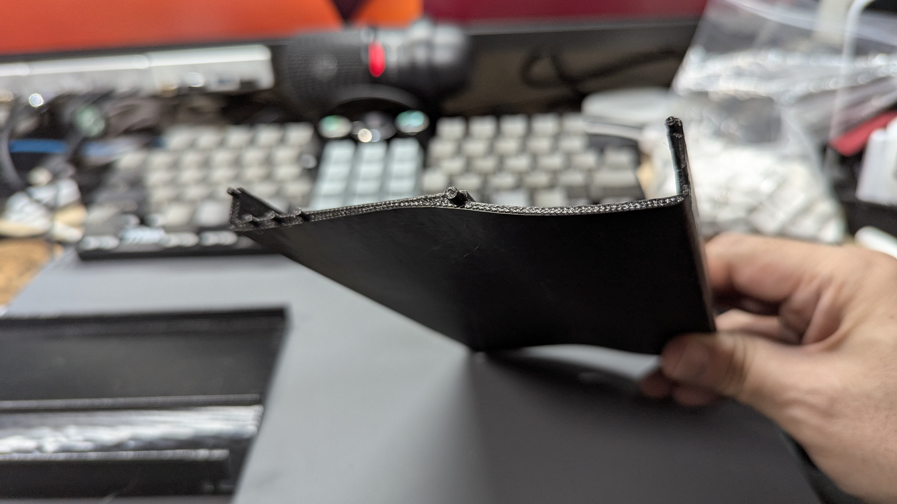

# TReK L.C.
GL516 inspire keyboard tray.  

（「L.C.」は、私の尊敬するインダストリアルデザイナー「ルイジ・コラーニ（Luigi Colani）」氏のイニシャルから取っています）

このケースデータは、サリチル酸さんの「GL516[^1] Template」のPCBデータを元にモデリングしているため、オリジナルのMITライセンスを継承して公開されます。

  TReK L.C. サイドカーボン柄 
   
   
  TReK L.C. サイド積層痕そのまま 
   

## ファイル内容
- TReK_Case_v4.3mf
  - 分割印刷用のプロジェクトになります。
- TReK_Case_v4.stl
  - トレイそのもののデータになります。

## 概要
このキーボードトレイは、サリチル酸さんの提唱しているキーボードケース規格「GL516[^1]」を基に、私が設計／頒布しているキーボードのうち、いくつかの条件に合ったキーボードでの使用を想定しています。
その条件というのは、おおまかには下記にのようになります。

- MCUを左右どちらかに配置している（中央配置のキーボードは使用不可です）
- スイッチプレート天面からMCU底面までの厚さが16mm
- MCU部分以外の、スイッチプレート底面から、PCB裏の最大突起物を含めた厚さが7mm以下（7mm以上ある場合は、厚さに応じたスペーサーを使用すれば装着出来ますが、トレイからPCBが浮き出てしまいます）

使用出来る対象キーボードは、

- TReK GT40Plus PARALLAX
- TReK G70 CLAVIS

になります。
下記のキーボードは使用不可になります。
- TReK GT40 DONUMCOELI（MCUが中央に配置されているため）
- TReK G50 TIJUANA（そもそもGL516ケースを使用する想定になっていないため）

## キーボードのマウント
GL516にある6箇所のネジ固定箇所は、基本的にはすべて7mmのスペーサーを使用します。

## パネルマウントケーブル
このトレイは、PCB底面より下の、MCU部分の厚さ（高さ）を7mm以下にしているため、Amazonなどで売っているパネルマウントのUSB-C延長ケーブルが使用出来ません。
なので、使用するにはパネルマウント部の高さが7mm以下のパネルマウントケーブルを自作する必要があります。

私が作成したケーブルのレシピを書いておきます。

### ケーブル自作に必要なもの
- [パネルマウントUSB-C Femaleコネクタケーブル](https://amzn.asia/d/55BpzSk)  
USB-C FemaleコネクタにUSB2.0用のケーブルがハンダ付けされているので、このケーブルをそのまま使用します。
- [USB-C Maleコネクタ](https://amzn.asia/d/052WZSY)  
これ以外でも、VCC, D+, D-, GNDの4端子があるUSB-C Maleコネクタであれば使えると思います。  
VCCと、GNDだけの、2端子のものは充電専用なので使用出来ません。
- 熱収縮チューブ  
USB-C Femaleコネクタにハンダ付けされているケーブルを、USB-C Maleコネクタにハンダ付けするのですが、その前にMale、Female両コネクタを保護するために熱収縮チューブを通しておきます。
Maleコネクタをハンダ付けする前に、すでにハンダ付けされているFemaleコネクタに熱収縮チューブを通し熱して固定しておくと良いでしょう。

- USB-C Femaleコネクタ作成例  

- USB-C Maleコネクタ作成例  

このパネルマウントFemaleコネクタは、固定部分にあるネジ穴にタップが切られていないので、ネジだけで固定することが出来ません。
なので、M2のネジとM2のナットが必要です。
M2のネジは自作キーボードをやっている方であれば特に用意しなくても手元にあると思いますが、私はナットが手元に無かったのでAmazonで購入しました。
- https://amzn.asia/d/24mBXOl

このパネルマウント延長ケーブルを使って、トレイにUSBコネクタを固定します。

かなりタイトなので、ケーブルをマスキングテープなどで固定しながらだと、上手く接続出来ると思います。

## 左右の接着
分割印刷用プロジェクト「TReK_Case_v4.3mf」を印刷すると、左右の接合部にダボのようなものが出来ます。

このダボ穴に接着剤を入れ、接着面にも塗り張り合わせて使用します。

[^1]: GL516デザインガイド https://zenn.dev/salicylic_acid3/books/gl516_design_guide
